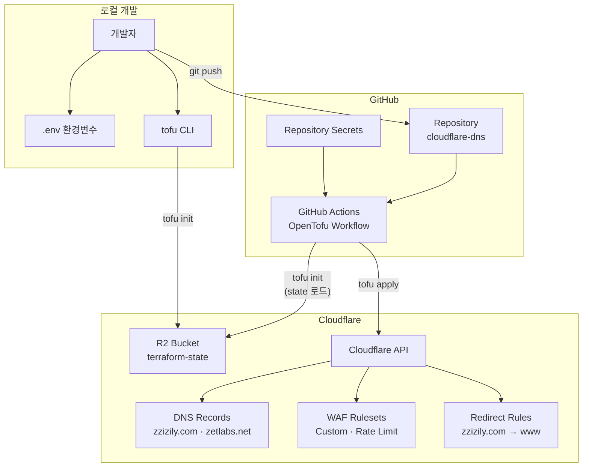

# 아키텍처

```mermaid
graph TB
    subgraph Local["로컬 개발"]
        dev["개발자"]
        env[".env 환경변수"]
        tofu["tofu CLI"]
        dev --> env
        dev --> tofu
    end

    subgraph GitHub["GitHub"]
        repo["Repository\ncloudflare-dns"]
        action["GitHub Actions\nOpenTofu Workflow"]
        secrets["Repository Secrets"]
        repo --> action
        secrets --> action
    end

    subgraph Cloudflare["Cloudflare"]
        r2["R2 Bucket\nterraform-state"]
        api["Cloudflare API"]
        dns["DNS Records\nzzizily.com · zetlabs.net"]
        waf["WAF Rulesets\nCustom · Rate Limit"]
        redir["Redirect Rules\nzzizily.com → www"]
    end

    dev -->|"git push"| repo
    action -->|"tofu init\n(state 로드)"| r2
    action -->|"tofu apply"| api
    tofu -->|"tofu init"| r2
    api --> dns
    api --> waf
    api --> redir
```
